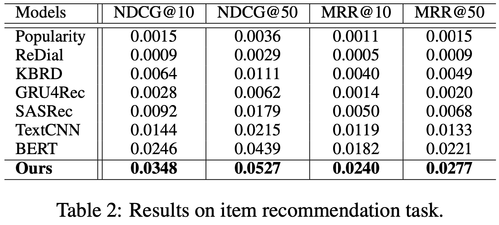
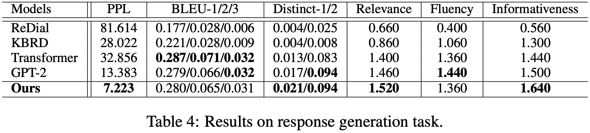
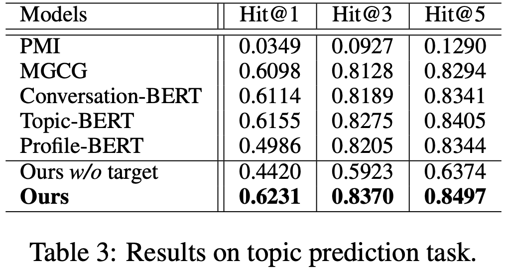

# Codes for TG-ReDial
We now publish the codes and the learned parameters of all models (baselines and ours) in our paper [***Towards Topic-Guided Conversational Recommender System***](https://arxiv.org/abs/2010.04125), to appear in *International Conference on Computational Linguistics*, 2020 (COLING2020).

Our dataset has been published in [**TG-ReDial**](https://github.com/RUCAIBox/TG-ReDial), which contains the description and dataset of our TG-ReDial.

Thanks to Yuanhang's hard work, in this project, you can implement the models in our paper by simple scripts. So ***please do not save your star :)***


## Environment

python==3.8.6

torch==1.6.0


## Getting Started
### Installation

```
pip install -r requirements.txt
```

### Get data

   This project only contains the code of TG-ReDial. You can get original data from [GoogleDrive](https://drive.google.com/drive/folders/1jLkNtUgzqBITQJsbOjSq20S2zzpY5Foj?usp=sharing) or [BaiduNetDisk](https://pan.baidu.com/s/1fthFPz8Qjt54m4NR2G9AIA), the password for baidunetdisk is cc2o. 

   For the convenience of implementing these models, we have preprocessed all the data and prepared all trained model parameters, you can get them from [Google Drive](https://drive.google.com/drive/folders/14MBg4UfWwWL2nuTJtOmVL0QP9-zw_4hJ?usp=sharing). You should download them and place them in proper path, then use our script to test or retrain the model.
   
   First, placed the *data_move.tar.gz* in ./TG_CRS_Code/
   Then, run the following code
    ```
      tar zxvf data_move.tar.gz
      bash data_move/move_data_back.sh
    ```

### Recommender Module



    1. Ours
    
    ```
    cd Recommender/Union
    # training
    bash script/train_Ours.sh
    # testing
    bash script/test_Ours.sh
    ```
    2. BERT
    
    ```
    cd Recommender/Union
    # training
    bash script/train_BERT.sh
    # testing
    bash script/test_BERT.sh
    ```
    3. TextCNN
    ```
    cd Recommender/TextCNN
    # training
    bash script/train.sh
    # testing
    bash script/test.sh
    ```
    4. SASRec
    ```
    cd Recommender/Union
    # training
    bash script/train_SASRec.sh
    # testing
    bash script/test_SASRec.sh
    ```
    5. GRU4Rec
    ```
    cd Recommender/GRU4Rec
    # training
    bash script/train.sh
    # testing
    bash script/test.sh
    ```
    6. KBRD
    ```
    cd Conversation/KBRD 
    bash scripts/both.sh <num_exps> <gpu_id>
    ```
    7. ReDial
    ```
    cd Conversation/KBRD 
    bash scripts/baseline.sh <num_exps> <gpu_id>
    ```
### Response Generation Module



	1. Ours
   
    ```
    cd Conversation/Union
    
    # Prepare the predicted data, note that we have prepared, so you can skip this step
    #	To run ours Response Generation Model, we need to use movie predicted by 
    # ours recommender model and topic predicted by ours topic prediction model. 
    # After training the latter two models, you can use them command to get the 
    # predicted consequence
    bash ../../TopicGuiding/Ours/script/test.sh <gpu_id>
    cp ../../TopicGuiding/Ours/data/identity2topicId.json data/data_Ours
    bash ../../Recommender/Union/script/gen_pred_mids.sh
    cp ../../Recommender/Union/data/data_p_Ours/identity2movieId.json data/data_Ours
    
    # prepare the data, note that we have prepared, so you can skip this step
    bash script/Ours/prepare_data.sh
    
    # training
    bash script/Ours/train.sh
    # testing ppl
    bash script/Ours/test_ppl.sh
    # generating
    bash script/Ours/generate.sh
    # eval generation
    bash script/Ours/test_gene_metric.sh generation/v11051_gen_output.txt
    ```
    2. GPT2
    ```
    cd Conversation/Union
    # prepare for data, note we have prepared, so you can skip this step
    bash script/GPT2/prepare_data.sh
    # training
    bash script/GPT2/train.sh
    # testing ppl
    bash script/GPT2/test_ppl.sh
    # generating
    bash script/GPT2/generate.sh
    # eval generation
    bash script/GPT2/test_gene_metric.sh generation/v1116_gpt2_gen_output.txt
    ```
    3. Transformer
    ```
    cd Recommender/Transformer
    # training
    bash script/Transformer/train.sh
    # testing ppl and generating
    bash script/Transformer/test_ppl.sh
	# eval generation
	bash script/test_gene_metric.sh output/output_test_both_epoch_-1.txt
	 ```
	 4. KBRD
	 ```
    cd Recommender/KBRD
    # training and testing ppl
    bash scripts/t2t_rec_rgcn.sh <num_exps> <gpu_id>
    # generating and eval generation
    bash myscript/generate.sh 
	 ```
### Topic prediction Module



   ```
   cd TopicGuiding/Model_You_Want
   # training
   bash script/train.sh
   # testing
   bash script/test.sh
   ```


## Reference

If you use our code, please kindly cite our papers. [Towards Topic-Guided Conversational Recommender System](https://arxiv.org/abs/2010.04125)

```
@inproceedings{zhou2020topicguided,
  title={Towards Topic-Guided Conversational Recommender System}, 
  author={Kun Zhou and Yuanhang Zhou and Wayne Xin Zhao and Xiaoke Wang and Ji-Rong Wen},
  booktitle = {Proceedings of the 28th International Conference on Computational
               Linguistics, {COLING} 2020, Barcelona, Spain, December 8-11,
               2020},
  year      = {2020}
}
```
